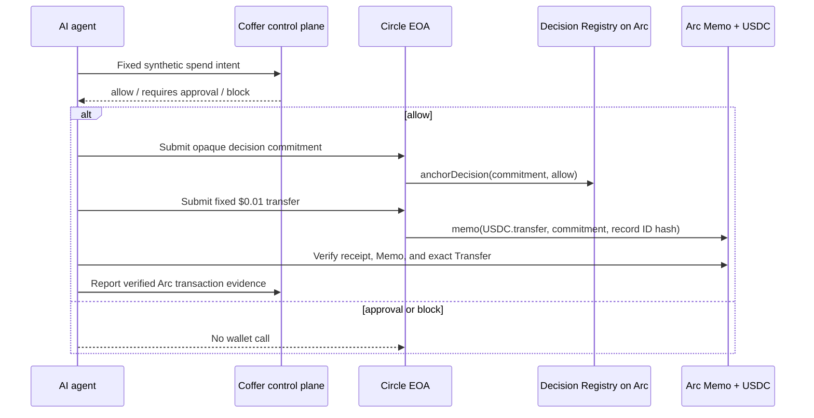

# Coffer × Arc

**Transaction control for AI-agent money.** Coffer decides whether an agent may spend before Circle signs anything, then binds the approved decision to a USDC settlement on Arc.

This repository is the narrow, reproducible Arc integration submitted to the Arc Programmable Money Hackathon’s **Agentic Economy** track. It contains a transparent hackathon reference policy, the onchain commitment registry, Circle Developer-Controlled EOA adapter, Memo-bound USDC settlement, independent receipt verification, fixed-scenario demo, tests, and deployment tooling. Those are the implementation surfaces submitted for judging. Coffer’s pre-existing policy intelligence and production control plane remain private, are product context only, and are not offered as judge-evaluable source.

## What the MVP proves



The three server-defined scenarios are evaluated from their public intent fields by a narrow reference policy: unknown agents/vendors or requests over the sample remaining budget block, amounts over the sample auto-approval threshold require approval, and compliant requests allow. They demonstrate:

- **Allow:** an allowlisted agent buys a synthetic market signal for `$0.01` Arc Testnet USDC.
- **Approval:** a `$12.00` request crosses the human-approval threshold; no wallet call occurs.
- **Block:** an unknown vendor is rejected before wallet execution.

## Why Arc and Circle are essential

- Arc Testnet is USDC-native and provides the settlement layer.
- Arc’s Memo contract binds the USDC call data to the opaque Coffer decision commitment and public record-ID hash.
- The registry creates an immutable, non-custodial proof that the decision existed before settlement.
- A dedicated Circle Developer-Controlled payer **EOA** submits both transactions with stable UUIDv4 idempotency keys; a separate dedicated EOA is the receive-only synthetic vendor. An EOA is required for the payer because Arc Memo does not accept a smart-contract wallet as the direct caller.
- The verifier checks chain ID, contract addresses, operator, registry state/event, transaction sender/target, Memo fields, call-data hash, and the exact USDC `Transfer` event.

Arc Testnet configuration used by this repository:

| Item | Value |
| --- | --- |
| Chain ID | `5042002` |
| RPC | `https://rpc.blockdaemon.testnet.arc.io` (dRPC fallback: `https://rpc.drpc.testnet.arc.io`) |
| Explorer | `https://testnet.arcscan.app` |
| USDC | `0x3600000000000000000000000000000000000000` |
| Memo | `0x5294E9927c3306DcBaDb03fe70b92e01cCede505` |

## Run safely in mock mode

Node 22 and pnpm 10.33.4 are required.

```bash
corepack enable
pnpm install --frozen-lockfile --ignore-scripts
pnpm test
pnpm build
pnpm demo
```

Mock mode is explicit in the UI and terminal output. It does not call hosted Coffer, Circle, or Arc and does not create evidence links that could be mistaken for live transactions.

## Verify the implementation

```bash
pnpm typecheck
pnpm test
pnpm contract:compile
pnpm contract:test
```

The tests cover strict decision-before-wallet order, block/approval non-execution, server-controlled fixed payloads, deterministic Circle operation IDs, commitment construction, Registry storage/replay behavior, Memo/USDC receipt verification, indexed log identity, public-response redaction, and Web live-write authorization.

Reverify the committed historical Arc proof without credentials:

```bash
pnpm evidence:verify
```

The verifier uses two fixed, credential-free Arc Testnet RPCs in order and falls back only when the primary cannot reproduce the complete proof. An explicit `ARC_RPC_URL` or `--rpc-url` selects one operator-provided endpoint and disables automatic fallback.

## Live deployment

The hosted UI is an intentionally safe, fixed-scenario demo: it does not expose a general-purpose wallet or accept arbitrary transaction parameters. The live Arc claim is independently verifiable from the committed evidence artifact and the ArcScan records below.

| Public proof | Verifiable value | What it demonstrates |
| --- | --- | --- |
| Hosted demo | [coffer-arc-demo.vercel.app](https://coffer-arc-demo.vercel.app) | The fixed allow / approval / block product flow |
| Decision Registry | [`0x3d1787f00516ed4a30363b3fB3805bC78CC28F9D`](https://testnet.arcscan.app/address/0x3d1787f00516ed4a30363b3fB3805bC78CC28F9D) | Deployed Coffer commitment registry on Arc Testnet |
| Circle payer/operator EOA | [`0x79313e5EBcD4562c19301Fd41d43f7239606c9f4`](https://testnet.arcscan.app/address/0x79313e5EBcD4562c19301Fd41d43f7239606c9f4) | Dedicated transaction signer used for this synthetic demo |
| Registry deployment | [`0xb566…b33d`](https://testnet.arcscan.app/tx/0xb566327ea6c5685a43acdab6c1e765110352a8dabb0649f21fc9012e7cf6b33d) | Successful Registry contract deployment |
| Allow-decision anchor | [`0x1425…7d29`](https://testnet.arcscan.app/tx/0x1425d5a89cbf89e0dd03247f49e188fc62ea1a385db6b6fa409170fa6f2e7d29) | The opaque allow commitment recorded before settlement |
| Memo-bound USDC settlement | [`0x50d8…a5bb`](https://testnet.arcscan.app/tx/0x50d8df5b32b339172b976ceffb43a772a695fa47f7c6cfe24260719a6a1a5abb) | The fixed `$0.01` synthetic-vendor settlement on Arc Testnet |
| Settlement block | [`52053015`](https://testnet.arcscan.app/block/52053015) | Public block containing the verified settlement |
| Machine-readable evidence | [`deployments/arc-testnet-evidence.json`](deployments/arc-testnet-evidence.json) | Receipt-bound evidence consumed by the repository verifier |

Live writes remain Arc Testnet-only and intentionally gated behind a dedicated synthetic Coffer workspace, fixed server-side parameters, exact production host/origin, a judge access code, and explicit write confirmation. See `.env.example` and `docs/DEPLOYMENT.md`.

## Public, judge-evaluable scope

Included here:

- Arc/Circle integration and transaction encodings
- transparent hackathon reference decision policy and tests
- non-custodial decision registry
- strict evidence verifier
- fixed synthetic scenarios and polished demo UI
- deployment scripts, tests, and public evidence

Not included and not requested for judging credit:

- Coffer policy/risk evaluation logic
- concurrent budget engine
- approval/RBAC implementation
- production database, migrations, ledger, audit retention, billing, customer data, or operations

Judges can reproduce and audit the Arc execution path and fixed synthetic walkthrough from this repository. The private product may provide optional context, but it is not evidence for the submitted implementation and is not required for the local mock-mode review path.

## Repository terms

This is a public evaluation repository, not an open-source release. See [NOTICE](NOTICE.md). Security reports can be sent to `support@cofferapi.com`.
